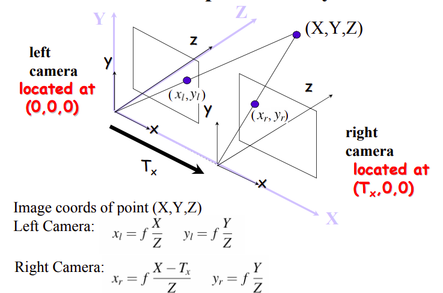
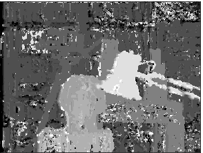
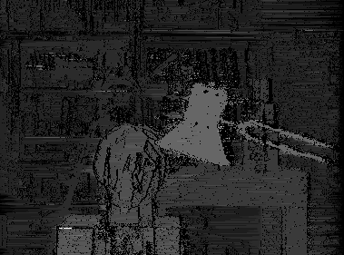

# generating-Disparity-maps-from-stereo-images
using block matching and dynamic programming to generate disparity maps from stereo images.

# brief introduction 

having 2 parallel stereo image we can deduce the depth from disparity.
we can compute the depth using this equation depth = (baseline * focal length) / disparity)

using epipolar line, we match  point X in 3D located in left image to the same point X right image and then calculate the disparity from the displacement between them as illustrated bellow.

<!--  -->
<!--  -->

  

# example

here we can see two stereo images

  
  

# results

block matching (left)
dynamic programming (right)

  
  

# extra resources and ref

* [DR Robert Collins lecture on stereo system](http://www.cse.psu.edu/~rtc12/CSE486/lecture09.pdf)

* [openCV implementation ](https://docs.opencv.org/master/dd/d53/tutorial_py_depthmap.html)
